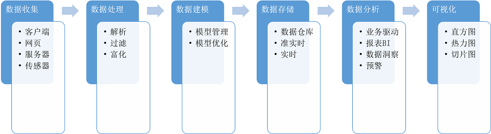

# xxhadoop
Data Analysis Using Hadoop/Spark/Storm/ES/ML etc. This is My Learning Notes/Code/Demo. Don't fork, Just star !    



## 几个概念
- BI: 包括ETL（数据的抽取、转换、加载），数据仓库（Data Warehouse），OLAP（联机分析处理），数据挖掘（Data Mining）等技术。
- Data Mining：在大量数据中自动搜索隐藏于其中的有着特殊关系性（属于Association rule learning）的信息的过程。相比商务智能，数据挖掘是一种更加学术的说法，强调技术和方法。
- OLAP：是一个建立数据系统的方法，其核心思想即建立多维度的数据立方体，以维度（Dimension）和度量（Measure）为基本概念，辅以元数据实现可以钻取（Drill-down/up）、切片（Slice）、切块（Dice）等灵活、系统和直观的数据展现。

## 数据处理开源技术分类汇总
### 计算引擎
- Hadoop: Hadoop实现了一个分布式文件系统（Hadoop Distributed File System），简称HDFS。除了文件存储，Hadoop还有最完整的大数据生态，包括机器管理、NoSQL KeyValue存储（如HBase）、协调服务（Zookeeper等）、SQL on Hadoop（Hive）等。[Hadoop生态架构图](https://github.com/junneyang/xxhadoop/blob/master/hadoop.jpg)
- Spark
- Flink
- Storm

### 列式数据库
- HBase
- Cassandra：Facebook开源NoSQL，解决HBase中心节点问题，无中心架构
- Parquet：Hadoop的列存储格式

### 时间序列数据库
- InfluxDB：分布式时间序列数据库
- OpenTSDB：在HBase上的分布式时间序列数据库
- Prometheus：一种时间序列数据库和服务监测系统
- Heroic：基于Cassandra和Elasticsearch的可扩展的时间序列数据库

### 数据存储
- 经典数据仓库: HDFS + ORC/Parqet + Hive/SparkSQL
- 实时数据仓库: HDFS + Kudu + Impala
- 在线分析:    HDFS + HBase + Phoenix
- 时序分析:    OpenTSDB/InfluxDB/Prometheus
- 多维分析:    Druid/Kylin

### 实时分析
- RDB：MySQL/PostgreSQL/Oracle方案，或者GreenPlum方案。[参考资料](https://yq.aliyun.com/articles/405191)
- Druid: Druid的很多设计思想来源于Google的秘密分析武器PowerDrill，从功能上，和Apache开源的Dremel也有几分相似。[参考资料](https://www.outlyer.com/blog/top10-open-source-time-series-databases/)
- Pinot：与Druid最接近的系统，Linkedin于2015年底开源的一个分布式列式数据存储系统。
- Kylin：Apache开源的分布式分析引擎，提供了Hadoop之上的SQL查询接口及多维分析（OLAP）能力，可以支持超大规模数据。最初由eBay公司开发并于2015年贡献至开源社区。它能在亚秒内查询巨大的Hive表。Kylin, Mondrian, Saiku系统的整合可以作为通用的BI平台，参考：https://tech.youzan.com/kylin-mondrian-saiku/
- Dremel：Google 的“交互式”数据分析系统，支持嵌套数据类型的列存储，这个特性是Druid缺少的。
- Drill：Apache Drill 通过开源方式实现了 Google’s Dremel。Apache Drill的架构，整个思想还是通过优化查询引擎，进行快速全表扫描，以快速返回结果。
- ElasticSearch：Elastic公司推出的一个基于Lucene的分布式搜索服务系统，它是一个高可靠、可扩展、分布式的全文搜索引擎。ES在前几年的定位一直是文本的倒排索引引擎，用于文本搜索的场景。最近几年，Elastic公司将ES用于日志分析和数据的可视化，慢慢转成一个数据分析平台。
- Kudu：支持快速分析的新型Hadoop存储系统，一般联合Impala的SQL一起使用，[官网](http://kudu.apache.org/)，内存开销较大，速度稍好于Hive。
~~- Crate：开源大数据存储，因为Elasticsearch性能实在太出众了，但是dsl接口不好使。有人拿Elasticsearch做为底层，上层封装了一个SQL接口，从何正式变成了一种数据库，叫 http://crate.io~~
- Splunk：用于机器生成的数据的分析

### SQL On Hadoop方案
- Hive/SparkSQL
- Impala/Presto/Shark
- HBase + SQL(Phoenix, Salesforce开源)

### 数据采集与ETL
- Apache Flume：管理大量日志数据的服务，[参考](http://flume.apache.org/FlumeUserGuide.html)
- Apache Kafka：分布式发布-订阅消息系统
- Apache Sqoop：在Hadoop和结构化的数据存储区之间传送数据的工具
- Facebook Scribe：流日志数据聚合器
- Fluentd：采集事件和日志的工具
- Logstash：用于管理事件和日志的工具
- Linkedin Gobblin：LinkedIn的通用数据摄取框架
- StreamSets Data Collector：连续大数据采集的基础设施，可简单地使用IDE
- Statsd：StatsD 是一个 NodeJs 的 daemon 程序，简单轻巧，使用 UDP 协议，专门用来收集数据，收集完数据就发送到其他服务器进行处理
- LogDevice：来自Facebook的分布式日志数据存储系统 [参考1](http://www.infoq.com/cn/news/2017/10/LogDevice-Facebook) [参考2](https://github.com/facebookincubator/LogDevice)

### 任务调度与工作流
- Spotify Luigi：构建批处理作业的复杂管道的Python包，它能够处理依赖性解析、工作流管理、可视化、故障处理、命令行一体化等等问题
- Apache Aurora：在Apache Mesos之上运行的服务调度程序
- Marathon：用于长期运行服务的Mesos框架
- Apache Oozie：工作流作业调度程序
- Chronos：分布式容错调度
- Linkedin Azkaban：批处理工作流作业调度
- Schedoscope：Hadoop作业敏捷调度的Scala DSL；
- Sparrow：调度平台
- Airflow：一个以编程方式编写、调度和监控工作流的平台
- jobber: 简单的替代cron的工具, [参考1](https://github.com/dshearer/jobber), [参考2](https://dshearer.github.io/jobber/)
- schedulix：enterprise job scheduling system, [参考1](https://github.com/schedulix/schedulix) [参考2](http://www.schedulix.org/en/features)

### 系统部署运维
- Apache Ambari：Hadoop管理的运作框架，是一个类似marathon的CS模式的框架，并且可以自定义新的服务。[参考1](https://community.hortonworks.com/questions/96507/devops-tools-used-in-ambari.html) [参考2](https://www.jianshu.com/p/3cbe239a68cb)
- Apache Bigtop：Hadoop生态系统的部署框架
- Apache Helix：集群管理框架
- Apache Slider：一种YARN应用，用来部署YARN中现有的分布式应用程序
- Brooklyn：用于简化应用程序部署和管理的库
- Buildoop：基于Groovy语言，和Apache BigTop类似
- Cloudera HUE：和Hadoop进行交互的Web应用程序
- Hortonworks HOYA：可在YARN上部署HBase集群的应用

### 监控告警方案
- 传统方案：StatsD/CollectD + Influxdb/whisper  + Grafana/graphite
- 容器监控方案（K8S）：Heapster（cAdvisor）+Grafana+InfluxDB/ElasticSearch
- 主机监控方案（marathon）：node-exporter、prometheus、grafana + alartmanager
- 采集 cAdvisor, Heapster, collectd, Statsd, Tcollector, Scout
- 存储 InfluxDb, OpenTSDB, Elasticsearch
- 展示 Graphite, Grafana, facette, Cacti, Ganglia, DataDog
- 告警 Nagios, prometheus, Icinga, Zabbix
- glances：Glances an Eye on your system. A top/htop alternative [参考1](https://github.com/nicolargo/glances)
- 方案：```
方案
收集：statsd/collectd/cadvisor
缓冲：kafka/logstash
存储与多维分析：druid/es/prometheus
可视化：grafana
报表：metabase/superset
告警：alertmanager
监控维度
系统（cpu mem disk net）
进程
中间件```

### BI与可视化
- Tableau：商业智能平台	
- Qilk：商业智能和分析平台
- FineBI：国内商业BI平台
- Looker：新生代商用BI工具		
- Pentaho：商业智能平台			
- Redshift：Amazon服务，可以理解为用于大数据分析的PostgreSQL，基于PostgreSQL的数据仓库服务
- Superset：最初Airbnb开源，目前Apache Incubator孵化器项目，需要选择指标Metric、分组条件、过滤条件作图，SQL支持较弱，不够灵活，Join支持较弱
；Superset在0.11版本之后加入SQL Lab功能，好像比较差；文档不够好；长期只有一个主力开发；Flask App Builder: 应用框架；SQLAlchemy：ORM支持SQL查询
；React + Redux：前端SQL编辑器交互。[参考](https://github.com/apache/incubator-superset)
- Redash：输入SQL输出图标；支持Query Snippet与Query Parameters，灵活支持定制参数；文档丰富；长期只有一个主力开发；Flask-RESTful：应用框架；Flask-SQLAlchemy：数据库操作；Flask-Login：认证授权；AngularJS（1.5）：前端；Redis：查询锁，防止多个相同查询同时进行；docker-compose：一键部署
- Metabase：Metabase非常注重非技术人员（如产品经理、市场运营人员）在使用这个工具时的体验，让他们能自由地探索数据，回答自己的问题；有一个团开发；Metabase是三个项目中唯一提供完整 API 文档的项目；Clojure：后端语言；React + Redux：前端语言。[参考](https://metabase.com/)
- Tableau：商业智能平台，https://www.tableau.com/zh-cn/products/prep#video
- PowerBI: 商业智能平台
- SpagoBI：开源商业智能平台
- Imply：An interactive data exploration UI for Druid http://pivot.imply.io/

### 可视化
- Kibana	更偏向可视化；针对ES的数据可视化方案，可查询日志数据、构建仪表盘；既支持检索，又支持数据浏览
- Grafana	更偏向可视化；开源仪表盘工具，支持Graphite、InfluxDB与 OpenTSDB、Elasticsearch、druid等数据源；支持可视化，不做数据的检索与浏览；两个工具可以结合使用，Kibana分析数据-->ES-->再使用Grafana渲染
- Graphite：可扩展的实时图表
- Zeppelin：[a notebook-style collaborative data analysis](https://zeppelin.apache.org/docs/latest/index.html)
- Jtopo: 拓扑可视化，[参考1](https://github.com/gongxufan/web-topology) [参考2](https://gongxufan.github.io/web-topology/topologyEditor.html) [参考3](https://gongxufan.github.io/2016/12/07/topology-editor/)

### 物联网IOT
- TempoIQ：基于云的传感器分析
- 2lemetry：物联网平台
- Pubnub：数据流网络
- ThingWorx：ThingWorx 是让企业快速创建和运行互联应用程序平台
- IFTTT：IFTTT 是一个被称为 “网络自动化神器” 的创新型互联网服务，它的全称是 If this then that，意思是“如果这样，那么就那样
- Evrythng：Evrythng则是一款真正意义上的大众物联网平台，使得身边的很多产品变得智能化

### 云计算平台建设
- 发展理念：大中台、小前台
- 建设路线：云化、平台化、服务化、一体化、自动化、智能化、场景化
- 主要方向：采集平台、数据平台、多维分析与BI平台、Web应用微服务平台、调度平台、可视化平台、运维监控平台
- 影响力建设：Confluence-Wiki系统建设、物联网平台计划

## 参考资料					
- 数据可视化的开源方案: Superset vs Redash vs Metabase: http://hugoren.iteye.com/blog/2407364					
- 数据可视化的开源方案: Superset vs Redash vs Metabase (一): https://blog.csdn.net/qirong_onlylove/article/details/79407900					
- 数据可视化的开源方案: Superset vs Redash vs Metabase (二): https://blog.csdn.net/qirong_onlylove/article/details/79407917					
- kibana 与 grafana开源可视化方案对比：https://www.cnblogs.com/tgzhu/p/6865770.html					
- 最全的“大数据”学习资源：http://lxw1234.com/archives/2016/05/649.htm
- 非常全的大数据相关资源整理：http://www.ppvke.com/Blog/archives/41453
- 非常全的大数据相关资源整理：http://suanfazu.com/t/topic/13659/1
- A Comparison of Time Series Databases and Netsil’s Use of Druid：https://blog.netsil.com/a-comparison-of-time-series-databases-and-netsils-use-of-druid-db805d471206
- 研发解决方案介绍-基于statsD+Graphite 智能监控解决方案：https://blog.csdn.net/qq_27384769/article/details/62895650
- 统计平台思路分析：https://ruby-china.org/topics/29508
- Which data warehouse should you use：https://medium.com/@metabase/which-data-warehouse-should-you-use-a49f1f126ed3
- Druid和Kylin在美团点评的选型与实践：http://www.ouyangchen.com/wp-content/uploads/2017/03/Meetup-Druid%E5%92%8CKylin%E5%9C%A8%E7%BE%8E%E5%9B%A2%E7%82%B9%E8%AF%84%E7%9A%84%E9%80%89%E5%9E%8B%E4%B8%8E%E5%AE%9E%E8%B7%B5.pdf
- Apache Kylin中使用Streaming Table构建准实时Cube：http://lxw1234.com/archives/2016/06/686.htm
- presto、druid、sparkSQL、kylin的对比分析，如性能、架构等，有什么异同：https://www.zhihu.com/question/41541395
- Kudu:支持快速分析的新型Hadoop存储系统：https://blog.csdn.net/clerk0324/article/details/71643276
- 小米架构师：亿级大数据实时分析与工具选型：https://sdk.cn/news/4577
- Elasticsearch vs. Impala for analytics：https://www.quora.com/Elasticsearch-vs-Impala-for-analytics
- HAWQ取代传统数仓实践（五）——自动调度工作流（Oozie、Falcon）：https://blog.csdn.net/wzy0623/article/details/72476848
- Kudu设计原理初探：https://blog.csdn.net/nosqlnotes/article/details/79496002
- KUDU--秒级查询的数据仓库：https://blog.csdn.net/miyatang/article/details/73829429
- Kudu，支持快速分析的新型Hadoop存储系统：https://www.cnblogs.com/wuxian11/p/6478581.html
- Saiku + Kylin 多维分析平台探索：https://blog.csdn.net/ronmy/article/details/72627998
- Saiku + Kylin 多维分析平台探索：https://www.meteorite.bi/products/saiku
- Druid vs 其他系统：https://www.cnblogs.com/bonelee/p/6248172.html
- Ultra-fast OLAP Analytics with Apache Hive and Druid – Part 1 of 3：https://zh.hortonworks.com/blog/apache-hive-druid-part-1-3/
- 深度解析-Druid在OneAPM的大数据分析实践：https://mp.weixin.qq.com/s?__biz=MzA4MTkyODIzMA==&mid=2651498747&idx=1&sn=2f95010fed3bc82da07a67bb3930d054&scene=0#wechat_redirect
- 蚂蜂窝大数据多维分析 DRUID 引擎实践：https://www.sohu.com/a/192050856_657921
- Druid + Grafana 应用实践：https://www.cnblogs.com/tgzhu/p/7120136.html
- 三种技术的融合：https://segmentfault.com/a/1190000002967413
- SQL for ElasticSearch–Crate.io安装配置和体验：http://lxw1234.com/archives/2015/12/590.htm
- 开源SQL数据库CrateDB发布新版本，并取得1100万美元融资：https://www.songma.com/news/txtlist_i1051v.html
- 驱动海量大数据实时多维分析，优酷为什么会选择Druid：https://www.sohu.com/a/109761742_470008
- Druid在OneAPM的大数据分析实践：http://chinahadoop.com/archives/1330
- Apache Kylin在美团数十亿数据OLAP场景下的实践：https://www.iteblog.com/archives/1710.html
- 数据分析必备｜你不得不知道的11款数据分析工具：http://www.woshipm.com/pmd/314444.html
- OLAP及分析工具选型：https://blog.csdn.net/spirit_zyl/article/details/59117744
- presto、druid、sparkSQL、kylin的对比分析，如性能、架构等，有什么异同：https://www.zhihu.com/question/41541395
- 使用graphite来监控业务系统：https://www.jianshu.com/p/3d98196c4290
