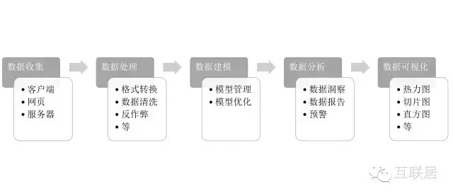

# xxhadoop
Data Analysis Using Hadoop/Spark/Storm/ES/ML etc. This is My Learning Notes/Code/Demo. Don't fork, Just star !

## 几个概念
- BI: 包括ETL（数据的抽取、转换、加载），数据仓库（Data Warehouse），OLAP（联机分析处理），数据挖掘（Data Mining）等技术。
- Data Mining：在大量数据中自动搜索隐藏于其中的有着特殊关系性（属于Association rule learning）的信息的过程。相比商务智能，数据挖掘是一种更加学术的说法，强调技术和方法。
- OLAP：是一个建立数据系统的方法，其核心思想即建立多维度的数据立方体，以维度（Dimension）和度量（Measure）为基本概念，辅以元数据实现可以钻取（Drill-down/up）、切片（Slice）、切块（Dice）等灵活、系统和直观的数据展现。

## 数据处理开源技术分类汇总
### 计算引擎
- Hadoop: Hadoop实现了一个分布式文件系统（Hadoop Distributed File System），简称HDFS。除了文件存储，Hadoop还有最完整的大数据生态，包括机器管理、NoSQL KeyValue存储（如HBase）、协调服务（Zookeeper等）、SQL on Hadoop（Hive）等。[Hadoop生态架构图](https://github.com/junneyang/xxhadoop/blob/master/hadoop.jpg)
- Spark
- Flink
- Storm

### 列式数据库
- HBase
- Cassandra

### 时间序列数据库
- InfluxDB：分布式时间序列数据库
- OpenTSDB：在HBase上的分布式时间序列数据库
- Prometheus：一种时间序列数据库和服务监测系统

### 实时分析
- Druid: Druid的很多设计思想来源于Google的秘密分析武器PowerDrill，从功能上，和Apache开源的Dremel也有几分相似。
- Pinot：与Druid最接近的系统，Linkedin于2015年底开源的一个分布式列式数据存储系统。
- Kylin：Apache开源的分布式分析引擎，提供了Hadoop之上的SQL查询接口及多维分析（OLAP）能力，可以支持超大规模数据。最初由eBay公司开发并于2015年贡献至开源社区。它能在亚秒内查询巨大的Hive表。
- Dremel：Google 的“交互式”数据分析系统，支持嵌套数据类型的列存储，这个特性是Druid缺少的。
- Drill：Apache Drill 通过开源方式实现了 Google’s Dremel。Apache Drill的架构，整个思想还是通过优化查询引擎，进行快速全表扫描，以快速返回结果。
- ElasticSearch：Elastic公司推出的一个基于Lucene的分布式搜索服务系统，它是一个高可靠、可扩展、分布式的全文搜索引擎。ES在前几年的定位一直是文本的倒排索引引擎，用于文本搜索的场景。最近几年，Elastic公司将ES用于日志分析和数据的可视化，慢慢转成一个数据分析平台。

### SQL On Hadoop方案
- Hive/SparkSQL
- Impala/Presto/Shark
- HBase + SQL(Phoenix, Salesforce开源)

